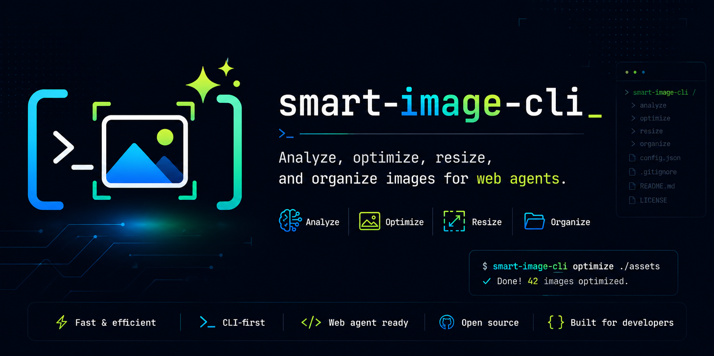

# Smart Image CLI

Agent-friendly CLI for analyzing, organizing, optimizing, resizing, and selecting website image assets from local project folders.

Smart Image CLI is designed for developers and AI coding agents that need to work with client-provided images without wasting time manually renaming, classifying, compressing, or resizing every file.

## Current status

| Area | Status |
| --- | --- |
| SDD artifacts | Ready for archive after final verification |
| Foundation and domain policies | Implemented |
| CLI shell and commands | Implemented |
| Storage/adapters | Implemented: SQLite index, JSON sidecars, guarded storage root, ExifTool metadata, Sharp processing |
| Application services | Implemented: analyze, config, doctor, library, optimize, pick, and runtime provider wiring |
| AI/provider adapters | Implemented: OpenAI-compatible image analysis plus local and AI text ranking providers |
| Semantic pick query | Implemented and verified for local default ranking, explicit metadata-only AI ranking, bounded `topK`, structured ranking output, and loud AI failure handling |

## What it will do

- Analyze image folders recursively with AI.
- Rename and organize images by detected category.
- Store local metadata and indexes inside the project image root.
- Optimize images for web delivery.
- Resize and crop images for website slots.
- Select the best available image for a requested section.
- Track where images were used so agents avoid repeating assets in the same slot.

## Picking images with semantic intent

`img pick` can select from the existing local index with structured constraints and, when `--query` is present, rank only the constraint-eligible candidates by metadata.

```bash
img --json pick ./assets --category bathroom --query "bright naturally lit shower"
img --json pick ./assets --category bathroom --query "bright shower" --semantic ai --top-k 5
```

- `--query <text>` enables intent ranking over indexed metadata (`subject`, `title`, `description`, `altText`, and `categories`).
- `--semantic local|ai` selects the ranker. Omitted `--semantic` defaults to `local` and emits a non-fatal stderr note.
- `--top-k <1..10>` bounds emitted ranking alternatives; the default is `3`.
- Local mode is deterministic, requires no provider, and is the default to avoid hidden spend.
- AI mode is explicit only and sends metadata text to the configured provider. It does not send image bytes, re-read images for ranking, or re-analyze images.
- AI ranking failures return structured `ai_ranking_failed` output with provider-error exit code `4`; there is no silent local fallback.

## Planned stack

| Concern | Choice |
| --- | --- |
| Runtime | Node.js 22+ |
| Language | TypeScript / ESM |
| CLI | Commander |
| Image processing | Sharp |
| Metadata | exiftool-vendored |
| Local index | SQLite + JSON sidecars |
| Testing | Vitest |

## Development

```bash
npm install
npm run typecheck
npm run lint
npm test
npm run build
```

OpenSpec archive validation is run manually with `npm run openspec:validate -- <change>`; it is a standalone SDD/archive gate, not part of the default build/test commands. The project wrapper disables OpenSpec telemetry for validation (`OPENSPEC_TELEMETRY=0`, `DO_NOT_TRACK=1`). `openspec list` may still report legacy `openspec/config.yaml` rules-format warnings for `apply`/`verify`; those warnings pre-date the semantic pick query change and are out of scope for this warning-cleanup chore.

## Roadmap

1. Foundation and CLI shell.
2. Local sidecar and SQLite storage.
3. Image processing and metadata adapters.
4. AI provider abstraction.
5. Analyze, optimize, pick, mark-used, list, stats, config, and doctor commands.
